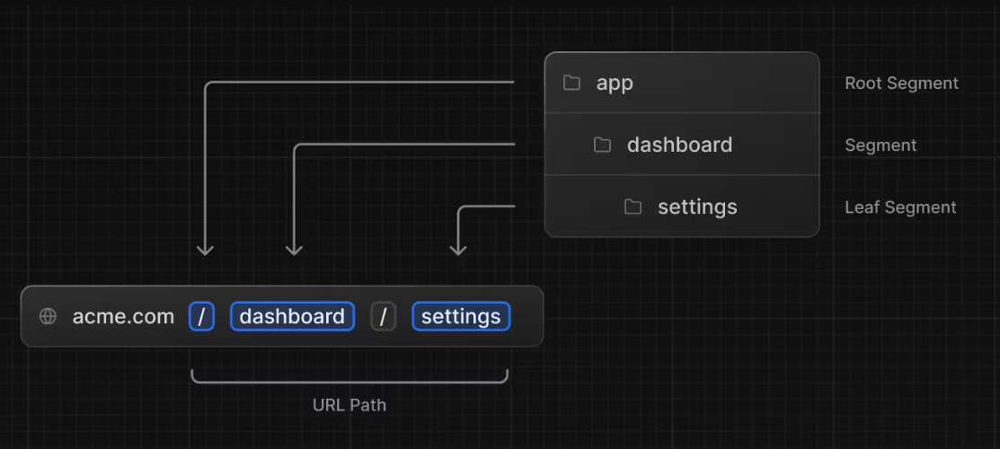
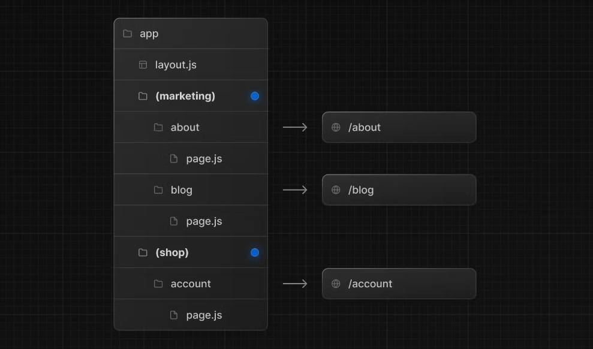

# Learn NextJs - App Router

## 🎯 Cách cài đặt Next.js

Doc: <https://nextjs.org/docs/getting-started/installation>

Để bắt đầu với Next.js, chúng ta cần cài đặt Node.js và npm trên máy tính của mình. Sau đó, có thể sử dụng lệnh sau để tạo một dự án Next.js mới:

```bash
npx create-next-app my-next-app
yarn create next-app my-next-app
```

Quá trình cài đặt sẽ có các bước:

```html
What is your project named? my-app
Would you like to use TypeScript? No / Yes ==> Yes
Would you like to use ESLint? No / Yes ==> Yes
Would you like to use Tailwind CSS? No / Yes ==> Yes
Would you like to use `src/` directory? No / Yes ==> No
Would you like to use App Router? (recommended) No / Yes ==> Yes
Would you like to customize the default import alias? No / Yes ==> Yes
What import alias would you like configured? @/* ==> @/*
```

Lưu ý: Trong quá trình tạo dự án, bạn sẽ có cơ hội chọn giữa JavaScript và TypeScript. Hãy chọn TypeScript nếu bạn muốn sử dụng Next.js với TypeScript.

Lệnh trên sẽ tạo một thư mục mới có tên "my-next-app

" và cài đặt các phụ thuộc cần thiết cho dự án Next.js. Bạn có thể điều hướng vào thư mục dự án và chạy lệnh sau để khởi chạy máy chủ phát triển:

```bash
cd my-next-app
npm install #cài đặt packages với npm
yarn #cài đặt packages với yarn
#sau đó 
npm run dev #start server với npm
yarn dev #start server với yarn
```

Sau khi máy chủ phát triển đã khởi chạy thành công, bạn có thể truy cập vào ứng dụng Next.js của mình bằng cách mở trình duyệt và truy cập địa chỉ http://localhost:3000.

---

## 🎯 Cấu trúc dự án

Bạn cần tuân thủ theo cách tổ chức project: cấu trúc thư mục, cặt đặt tên thư mục, file như Nextjs đã khuyến nghị.

Cụ thể xem: <https://nextjs.org/docs/getting-started/project-structure>

---

## 🎯 Hiển thị Hello World với NextJs

- Giải thích cách hoạt động của NextJs với App Router

- Thử tạo một component HelloWord xem NextJS có khác gì ReactJS không?

- Follow xử lý trong NextJS thế nào ?

---

## 🎯 Cách định nghĩa Routes

Xem chi tiết: https://nextjs.org/docs/app/building-your-application/routing/defining-routes

### 💥 Static Route

Cách tạo routes thông qua hình họa sau:


Bạn muốn có một URL: /dashboard: thì trong folder app bạn tạo một folder dashboard, và trong folder dashboard tạo tiếp một file pages.tsx


```html
├── app
│   ├── dashboard
│   │   ├── page.tsx
│   ├── page.tsx
```
**app/dashboard/page.tsx** có nội dung như sau:
```js
export default function Page() {
  return <h1>Hello, Dashboard Page!</h1>
}
```
Lưu ý: Bạn có thể đổi tên `Page` thành tên khác để phân biệt nếu muốn.




Bạn muốn có một URL: `/dashboard/settings` thì trong folder dashboard bạn tạo một folder settings, và trong folder settings tạo tiếp một file `page.tsx`

```html
├── app
│   ├── dashboard
│   │   ├── page.tsx
│   │   ├── settings
│   │   │   ├── page.tsx
│   ├── page.tsx
```

Kết luận: 

- bạn muốn URL như thế nào thì trong folder app tạo thư mục tương ứng với cấu trúc của URL
- folder đó được hiểu là route khi và chỉ khi nó chứa file `page.tsx`

### 💥 Route Groups

Là cách tổ chức cấu trúc route nhưng không phát sinh `segment` (URL).

Giúp bạn phân vùng quản lý các routes có tính năng liên quan lại một nhóm.



Tổ chức folder trong cặp ngoặc tròn `)marketing)`

Xem chi tiết: https://nextjs.org/docs/app/building-your-application/routing/route-groups


### 💥 Dynamic Routes

Để tạo một `Dynamic routes` bạn tạo folder và đặt tên trong cặp nguộc vuông. Ví dụ: `[id]`, `[slug]`

Cấu trúc như sau:


```html
app
├── blog
│   ├── [slug]
│       ├── page.tsx  
├── layout.jsx
|── page.tsx
```
Bạn sẽ nhận được tương ứng

|  URL | Params        |
| ----------- | ------------- |
| /blog/a     | { slug: 'a' } |
| /blog/b     | { slug: 'b' } |
| /blog/c     | { slug: 'c' } |

`slug` được là param và giá trị của nó biến động theo phần `segment` phía sau `/blog/` khi bạn truyền lên URL.

Xem chi tiết: https://nextjs.org/docs/app/building-your-application/routing/dynamic-routes


### 💥 Route Handlers

Route Handlers cho phép bạn tạo ra request và response API.

Hay hiểu đơn giản nó có thể làm công việc backend, tạo ra hệ thống RESTFUL API như NodeJs và ExpressJs

#### Định nghĩa một Resource API


```html
app
├── api
│   ├── users
│       ├── route.ts  
├── layout.jsx
|── page.tsx
```

Đơn giản, chỉ cần bạn tạo một folder bên trong app và đặt vào đó một file có tên `route.ts` thì NextJS hiểu đó là một Route handler

Ví dụ về một resource API Users


```html
app
├── api
│   ├── users
│   │   ├── [id]
│   │   │   ├── route.ts
│       ├── route.ts  
├── layout.jsx
|── page.tsx
```
Trong đó `api/users/route.ts` như sau:

```ts
const users = [
    {id: 1, name: 'David'},
    {id: 2, name: 'Tom'}
]
//GET api/users
export async function GET(request: NextRequest) {

  const searchParams = request.nextUrl.searchParams
  const query = searchParams.get('query')
  // query is "Tom" for /api/users?name=Tom

    /**
     * Ở đây bạn có thể liên kết trược tiếp với Dababase
     * Hoặc có thể gọi API
     *  */
   
    //getAll
    return Response.json(users)
}

//POST api/users

export async function POST(request: Request) {
    const body = await request.json();
    return Response.json(body)
}
```

Trong đó `api/users/[id]/route.ts` như sau:

```ts
const users = [
    {id: 1, name: 'David'},
    {id: 2, name: 'Tom'}
]
//GET api/users/:id
export async function GET(request: Request,
    { params }: { params: { id: string } }) {

    const id = params.id
    console.log('API users/:id',id);
    /**
     * Ở đây bạn có thể liên kết trược tiếp với Dababase
     * Hoặc có thể gọi API
     *  */
    //getById
    if(id){
        const user = users.find(u=> u.id == parseInt(id));
        return Response.json(user)
    }
    return Response.json({
        message: 'ID not undefined'
    })
    
}

//PUT api/users/:id
export async function PUT(request: Request,
    { params }: { params: { id: string } }) {

}

//DELETE api/users/:id
export async function DELETE(request: Request,
    { params }: { params: { id: string } }) {

}
```


Bạn có thể tìm thấy tất cả vấn đề liên quan tại: https://nextjs.org/docs/app/building-your-application/routing/route-handlers


---

## 🎯 Pages

Trong NextJS (App Router) `page.tsx` được xem như là EntryPoint

- page chấp nhận kiểu mở rộng .js, .jsx, .tsx
- page mặc định là **Server Components** nhưng bạn có thể chuyển qua Client Components
- pages có thể fetch data để lấy thông tin qua API

Xem chi tiết: https://nextjs.org/docs/app/building-your-application/routing/pages-and-layouts#pages

---

## 🎯 Link và Navigation

Có 2 cách để chuyển hướng giữa các routes trong NextJS:

- Sử dụng `<Link>` Component
- Sử dụng `useRouter` hook (Client Components)
- Sử dụng `redirect` function (Server Components)
- Sử dụng native History API

### 💥 Link

Ví dụ:

```tsx
/* app/page.tsx */
import Link from 'next/link'
 
export default function Page() {
  return <Link href="/dashboard">Dashboard</Link>
}
```

Xem chi tiết: https://nextjs.org/docs/app/building-your-application/routing/linking-and-navigating#link-component

### 💥 useRouter() Hook

Hook này chỉ cho phép sử dụng trong Client Components


```js
'use client'
 
import { useRouter } from 'next/navigation'
 
export default function Page() {
  const router = useRouter()
 
  return (
    <button type="button" onClick={() => router.push('/dashboard')}>
      Dashboard
    </button>
  )
}

```

Xem chi tiết: https://nextjs.org/docs/app/building-your-application/routing/linking-and-navigating#userouter-hook

### 💥 redirect function

Hàm này này chỉ cho phép sử dụng trong Server Components

```tsx
import { redirect } from 'next/navigation'
 
async function fetchTeam(id: string) {
  const res = await fetch('https://...')
  if (!res.ok) return undefined
  return res.json()
}
 
export default async function Profile({ params }: { params: { id: string } }) {
  const team = await fetchTeam(params.id)
  if (!team) {
    redirect('/login')
  }
 
  // ...
}
```

Xem chi tiết: https://nextjs.org/docs/app/building-your-application/routing/linking-and-navigating#redirect-function

### 💥 native History API

Xem chi tiết: https://nextjs.org/docs/app/building-your-application/routing/linking-and-navigating#using-the-native-history-api

---
Xem thêm  chuyển hướng tại:

- https://nextjs.org/docs/app/building-your-application/routing/redirecting

---

## 🎯 Layouts

### 🔸 Định nghĩa 1 layout

Trong NextJS (app router) bạn muốn trang nào có layout riêng thì trong folder route bạn tạo một file `layout.tsx`

Ví dụ bạn muốn /dashboard có layout khác đi


Trong folder dashboard tạo file layout.tsx, layout này sẽ dùng chung cho tất cả các URL bắt đầu là /dashboard/ Ví dụ: /dashboard/settings, /dashboard/products...

Còn không nó lấy `layout.tsx` ở `app/layout.tsx` làm layout chung cho toàn bộ trang. Cài này gọi là `Root Layout`

Và lưu ý răng component trong layout.tsx nên để một children prop để nó có thể hiển thị thành phần con


```js
export default function DashboardLayout({
  children, // will be a page or nested layout
}: {
  children: React.ReactNode
}) {
  return (
    <section>
      {/* Include shared UI here e.g. a header or sidebar */}
      <nav></nav>
 
      {children}
    </section>
  )
}
```

### 🔸 Lưu ý với layout

- layout chấp nhận kiểu mở rộng .js, .jsx, .tsx
- layout mặc định là **Server Components** nhưng bạn có thể chuyển qua Client Components
- layout có thể fetch data để lấy thông tin qua API
- Bạn không thể share data giữa layout cha và con, tuy nhiên bạn có thể fetch data giống nhau 1 hoặc nhiều lần, React sẽ tự động loại bỏ những yêu cầu để không ảnh hưởng đến hiệu suất
- 

### 🔸 Templates

Templates cũng giống như layouts để wrap các layout con hoặc page. Không giống như Layout, Templates sẽ re-render lại mỗi khi bạn chuyển hướng

Khuyến nghị: sử dụng layouts thay vì templates trừ khi bạn có lí do để sử dụng template

Cách để định nghĩa ra một template thì tương tự như layout


app/template.tsx

```js
export default function Template({ children }: { children: React.ReactNode }) {
  return <div>{children}</div>
}
```

The rendered output of a route segment with a layout and a template will be as such:

```js
<Layout>
  {/* Note that the template is given a unique key. */}
  <Template key={routeParam}>{children}</Template>
</Layout>
```

### 🔸SEO Meta Tag

Tại mỗi pages bạn có thể thay đổi thông tin trên thẻ head như meta title, meta description riêng cho từng trang như sau:


```js
import { Metadata } from 'next'
 
export const metadata: Metadata = {
  title: 'Dashboard Page',
}
 
export default function Dashboard() {
  return '...'
}

```
Cách trên mới chỉ là static Metadata, ngoài ra chúng ta còn có thể tạo Metadata động theo dynamic Route

## 🎯 Custom Page HTTP Error

Bạn có thể thay đổi giao diện của trang thông báo lỗi `404`, `500`

Bằng cách tạo ra 2 pages như cấu trúc sau:

```html
├── app
│   ├── 404.tsx
│   ├── 400.tsx
│   ├── page.tsx
```

### pages/404.tsx

```tsx
export default function Custom404() {
  return <h1>404 - Page Not Found</h1>
}
```

### pages/500.tsx

```tsx
export default function Custom500() {
  return <h1>500 - Server-side error occurred</h1>
}
```

Xem chi tiết: https://nextjs.org/docs/pages/building-your-application/routing/custom-error#404-page


## 🎯 Styling và Static Files

### 💥 Styling

Cách tổ để tổ chức Css trong NextJs

Chi tiết xem: https://nextjs.org/docs/app/building-your-application/styling


### 💥 Static Files

Cách tổ để tổ chức tài nguyên tĩnh: images, styles, fonts, etc

Chi tiết xem: https://nextjs.org/docs/app/building-your-application/optimizing