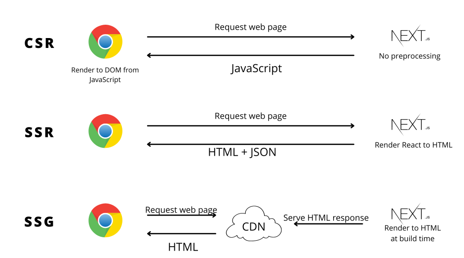
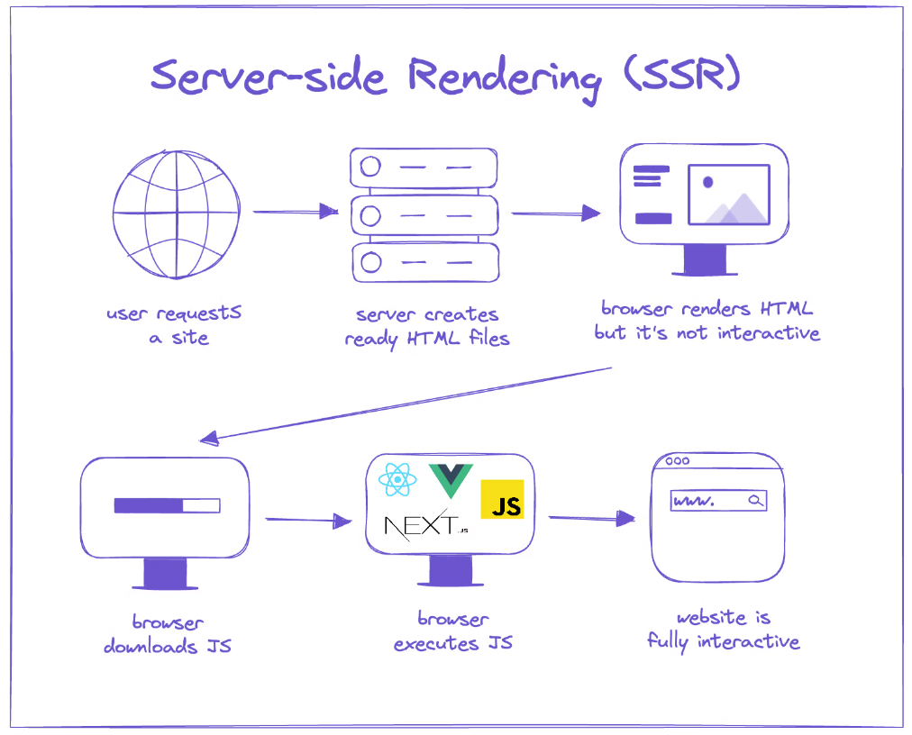
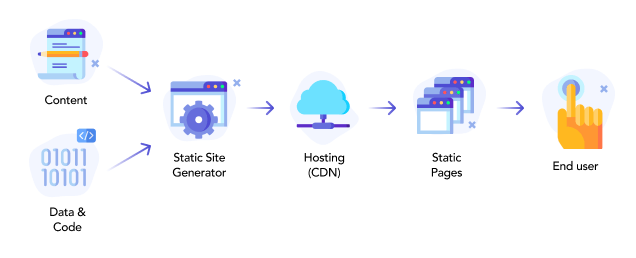
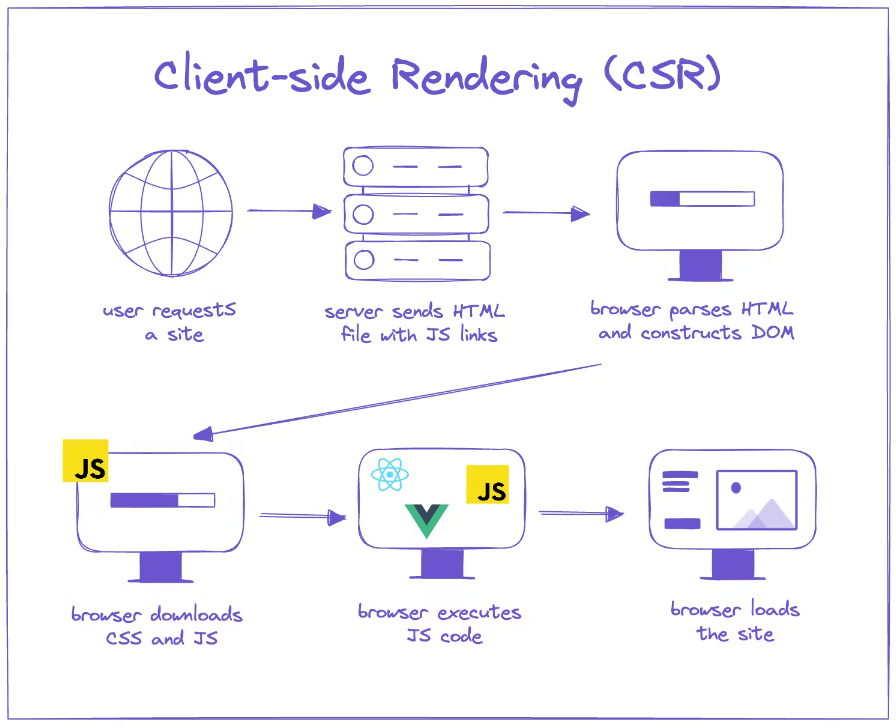

# Data Fetching and Rendering

## 🎯 Rendering

Tất cả các hình thức Render trong Nextjs có thể tóm tắt trong hình minh họa sau:



### 💥 Server-side Rendering (SSR)

Xem doc: https://nextjs.org/docs/pages/building-your-application/rendering/server-side-rendering

Trong Next.js, **Server-side Rendering (SSR)** là quá trình render trang web trên server mỗi khi có yêu cầu từ người dùng, thay vì tạo sẵn các trang HTML trong quá trình build như trong Static Site Generation (SSG). Với SSR, mỗi lần người dùng truy cập một trang, Next.js sẽ chạy mã JavaScript trên server để render trang HTML dựa trên dữ liệu và nội dung hiện tại, sau đó gửi trang đã render đó về trình duyệt.





### Cách hoạt động của SSR trong Next.js
SSR trong Next.js được thực hiện thông qua việc sử dụng hàm **`getServerSideProps`**, cho phép bạn fetch dữ liệu từ API, cơ sở dữ liệu hoặc các nguồn dữ liệu khác mỗi khi có yêu cầu truy cập trang từ người dùng.

1. **Pre-rendering mỗi yêu cầu**: Khi người dùng gửi yêu cầu đến một trang sử dụng SSR, Next.js sẽ chạy mã trên server, fetch dữ liệu, và render trang HTML dựa trên dữ liệu đó. Trang này sau đó được gửi về trình duyệt người dùng.

2. **Sử dụng `getServerSideProps`**: Đây là hàm dùng để fetch dữ liệu và xử lý logic trên server trước khi render trang. Mỗi khi có yêu cầu tới trang, Next.js sẽ gọi hàm này và kết quả của nó sẽ được dùng để render trang ngay lập tức.


### Ưu điểm của SSR

1. **Dữ liệu cập nhật real-time**: Vì trang được render mỗi khi có yêu cầu, dữ liệu luôn là dữ liệu mới nhất từ server.
2. **SEO tốt**: Giống như SSG, SSR cũng cho phép công cụ tìm kiếm lập chỉ mục dễ dàng, vì nội dung đã được render thành HTML trước khi gửi đến trình duyệt.
3. **Tùy biến theo người dùng**: SSR cho phép render các trang có nội dung tùy biến dựa trên thông tin người dùng hoặc các thông số từ yêu cầu HTTP.

### Nhược điểm của SSR

1. **Thời gian tải trang lâu hơn**: So với SSG, SSR thường chậm hơn vì server phải render trang mỗi khi có yêu cầu.
2. **Tải nặng cho server**: SSR yêu cầu server thực hiện việc xử lý mỗi khi có yêu cầu, điều này có thể làm tăng tải cho server khi có nhiều người dùng truy cập cùng lúc.


---

### 💥 Static Site Generation (SSG)


Static Site Generation (SSG) trong Next.js là một kỹ thuật render trang web trong đó các trang HTML được tạo sẵn trong quá trình **build** của ứng dụng và được lưu trữ dưới dạng tĩnh (static). Các trang này sau đó sẽ được phục vụ trực tiếp từ server hoặc CDN mà không cần bất kỳ xử lý nào từ server tại thời điểm người dùng yêu cầu.




Trong Next.js, SSG được sử dụng để tạo các trang HTML trước khi deploy, đảm bảo rằng các trang được render nhanh chóng, bởi vì chúng không cần phải render lại mỗi khi có yêu cầu từ người dùng. Điều này mang lại nhiều lợi ích, đặc biệt là về hiệu suất và SEO.

### Cách hoạt động của SSG trong Next.js

1. **Pre-rendering tại thời điểm build**: Next.js sẽ tạo ra các trang HTML tĩnh dựa trên nội dung từ file hệ thống hoặc API, sau đó lưu các trang này vào bộ nhớ (cache) để phục vụ khi có yêu cầu từ người dùng.
  
2. **Sử dụng `getStaticProps`**: Để lấy dữ liệu cần thiết cho một trang trong quá trình build, Next.js cung cấp một hàm gọi là `getStaticProps`. Hàm này cho phép bạn fetch dữ liệu từ một API, cơ sở dữ liệu, hoặc các nguồn dữ liệu khác và truyền vào trang trước khi nó được tạo.

3. **Sử dụng `getStaticPaths` (cho các trang động)**: Đối với các trang có đường dẫn động (dynamic routing), như các bài viết blog có slug, bạn có thể sử dụng `getStaticPaths` để chỉ định danh sách các đường dẫn cần được tạo trước.

### Ưu điểm của SSG

- **Tốc độ tải trang nhanh**: Do các trang đã được tạo sẵn, thời gian tải trang lần đầu tiên rất nhanh.
- **SEO tốt hơn**: Vì nội dung đã được render tĩnh, các công cụ tìm kiếm có thể dễ dàng lập chỉ mục.
- **Tối ưu tài nguyên**: SSG không yêu cầu xử lý tại thời điểm yêu cầu, giúp giảm tải cho server.

---

### 💥 Client-side Rendering (CSR)


**Client-side Rendering (CSR)** trong Next.js là một kỹ thuật mà quá trình render nội dung trang web xảy ra hoàn toàn trên trình duyệt của người dùng sau khi nhận được mã JavaScript từ server. Thay vì server gửi về một trang HTML hoàn chỉnh (như với SSR hoặc SSG), server chỉ gửi về một skeleton HTML cơ bản, và JavaScript sẽ được tải và chạy trên trình duyệt để render nội dung động.



Trong Next.js, CSR được thực hiện khi bạn không sử dụng các phương thức pre-rendering như `getStaticProps` hay `getServerSideProps`. Điều này thường được áp dụng cho các ứng dụng có tính tương tác cao, khi mà dữ liệu hoặc giao diện người dùng thay đổi theo thời gian hoặc phụ thuộc vào hành động của người dùng.

### Cách hoạt động của CSR trong Next.js

1. **Tải trang ban đầu**: Khi người dùng truy cập một trang, Next.js gửi một file HTML rất đơn giản (skeleton), cùng với các file JavaScript cần thiết.
  
2. **Render trên client**: Sau khi tải JavaScript, trang được render động bởi React, và dữ liệu cần thiết (nếu có) sẽ được fetch trực tiếp từ trình duyệt.

3. **Tương tác không cần tải lại trang**: Một trong những ưu điểm lớn của CSR là các thay đổi giao diện không yêu cầu phải tải lại toàn bộ trang, giúp cải thiện trải nghiệm người dùng khi tương tác với ứng dụng.


### Ưu điểm của CSR

1. **Trải nghiệm người dùng tốt hơn với ứng dụng có tính tương tác cao**: Khi người dùng tương tác với ứng dụng, các phần tử của trang có thể thay đổi mà không cần tải lại toàn bộ trang.
2. **Giảm tải cho server**: CSR giảm tải việc render từ server vì tất cả render đều xảy ra trên client.
3. **Cải thiện tốc độ khi điều hướng giữa các trang**: Sau khi ứng dụng và JavaScript đã được tải, điều hướng giữa các trang sẽ rất nhanh do không cần yêu cầu server render lại.

### Nhược điểm của CSR

1. **SEO kém**: Vì nội dung không được render sẵn trong HTML mà chỉ được render sau khi JavaScript chạy, các công cụ tìm kiếm có thể gặp khó khăn trong việc lập chỉ mục trang.
2. **Tốc độ tải trang lần đầu chậm**: Người dùng có thể phải chờ JavaScript được tải và thực thi trước khi họ thấy nội dung đầy đủ của trang.
3. **Hiệu suất**: Trình duyệt phải xử lý nhiều hơn, gây ra tình trạng chậm cho các thiết bị yếu hơn, đặc biệt là khi lượng JavaScript lớn.

### Khi nào nên sử dụng CSR?

CSR thường phù hợp cho các ứng dụng mà nội dung thay đổi dựa trên hành động của người dùng hoặc yêu cầu tải nội dung động như bảng điều khiển (dashboard), ứng dụng web có tính tương tác cao, hoặc các trang mà SEO không phải là ưu tiên hàng đầu.


### 💥 Automatic Static Optimization

Xem doc: https://nextjs.org/docs/pages/building-your-application/rendering/automatic-static-optimization

**Automatic Static Optimization** trong Next.js là một tính năng tự động quyết định cách một trang sẽ được render dựa trên cách bạn viết mã trong ứng dụng. Cụ thể, nếu một trang không sử dụng bất kỳ phương thức server-side nào (như `getServerSideProps` hoặc `getInitialProps`), Next.js sẽ tự động tối ưu trang đó thành một trang tĩnh (Static Site Generation - SSG) và tạo sẵn trong quá trình build.

### Cách hoạt động của Automatic Static Optimization

Khi Next.js phát hiện rằng trang không cần fetch dữ liệu hoặc thực hiện bất kỳ xử lý nào trên server khi có yêu cầu (tức là không có server-side logic), nó sẽ tự động **pre-render** trang đó thành một trang HTML tĩnh. Điều này xảy ra trong quá trình build của ứng dụng, và sau khi deploy, trang này được phục vụ ngay lập tức dưới dạng tĩnh mà không cần bất kỳ xử lý nào trên server tại thời điểm truy cập.

### Điều kiện để kích hoạt Automatic Static Optimization

Trang sẽ được coi là đủ điều kiện cho Automatic Static Optimization nếu:
1. **Không sử dụng `getServerSideProps`**: Điều này có nghĩa là trang không yêu cầu fetch dữ liệu hoặc xử lý logic trên server mỗi khi có yêu cầu từ người dùng.
2. **Không sử dụng `getInitialProps`**: Nếu trang sử dụng `getInitialProps`, Next.js sẽ không thể tối ưu trang đó thành tĩnh vì nó đòi hỏi xử lý phía server.
3. **Không có logic phụ thuộc vào runtime**: Tất cả logic cần để render trang đã có sẵn trong quá trình build.

### Ví dụ về Automatic Static Optimization
Nếu bạn viết một trang đơn giản như sau:

```jsx
// pages/about.js
export default function About() {
  return (
    <div>
      <h1>About Us</h1>
      <p>Welcome to our company!</p>
    </div>
  );
}
```

Trong ví dụ này, không có `getServerSideProps`, `getStaticProps`, hoặc `getInitialProps`, do đó Next.js sẽ tự động tối ưu trang này thành một trang tĩnh trong quá trình build. Khi người dùng truy cập trang `/about`, trang đã được tạo sẵn sẽ được phục vụ từ CDN hoặc server mà không cần phải render lại.

### Ưu điểm của Automatic Static Optimization

1. **Tăng tốc độ tải trang**: Các trang được tạo sẵn dưới dạng tĩnh, vì vậy chúng có thể được tải rất nhanh.
2. **Cải thiện SEO**: Các trang tĩnh đã được render sẵn giúp các công cụ tìm kiếm dễ dàng lập chỉ mục.
3. **Không cần cấu hình**: Next.js tự động xử lý việc tối ưu hóa mà không yêu cầu bạn phải cấu hình gì thêm.
4. **Tối ưu cho trải nghiệm người dùng**: Trang tĩnh không yêu cầu xử lý trên server khi người dùng truy cập, giúp giảm thời gian phản hồi từ server.

### Khi nào Automatic Static Optimization không được áp dụng

Nếu bạn sử dụng các phương thức như `getServerSideProps`, `getInitialProps`, hoặc có bất kỳ logic nào phụ thuộc vào thời điểm người dùng truy cập (ví dụ, trang có nội dung tùy thuộc vào thông tin người dùng), thì Next.js sẽ không áp dụng Automatic Static Optimization và trang sẽ được render trên server mỗi lần có yêu cầu.


## 🎯 Data Fetching

### 💥  getServerSideProps

Xem doc: https://nextjs.org/docs/pages/building-your-application/data-fetching/get-server-side-props

`getServerSideProps` là một hàm đặc biệt trong Next.js cho phép bạn **fetch dữ liệu từ server mỗi lần có yêu cầu** đến trang. Khi bạn sử dụng `getServerSideProps`, Next.js sẽ chạy hàm này trên server **mỗi khi** có người dùng truy cập vào trang, và dữ liệu được trả về từ hàm này sẽ được Next.js sử dụng để render trang HTML. Điều này có nghĩa là trang của bạn sẽ luôn được render dựa trên dữ liệu **cập nhật theo thời gian thực**, vì mỗi yêu cầu sẽ dẫn đến một lần gọi hàm server-side để lấy dữ liệu.

### Khi nào nên sử dụng `getServerSideProps`?

Bạn nên sử dụng `getServerSideProps` khi:
1. **Dữ liệu cần phải được cập nhật liên tục** và không thể tạo sẵn trong quá trình build (như với `getStaticProps`).
2. **Trang phụ thuộc vào dữ liệu theo người dùng**, như thông tin cá nhân hoặc yêu cầu dynamic dựa trên người dùng hiện tại.
3. **SEO** là ưu tiên và trang cần được pre-render với nội dung cập nhật, thay vì render phía client.

### Cách hoạt động của `getServerSideProps`

- **Pre-rendering mỗi lần có yêu cầu**: Khi người dùng truy cập vào trang sử dụng `getServerSideProps`, hàm này sẽ được thực thi trên server, fetch dữ liệu, và trả về kết quả để Next.js render trang với dữ liệu đó.
- **Server-side only**: Hàm này **chỉ chạy trên server** và không bao giờ chạy trên client. Điều này giúp bảo vệ dữ liệu nhạy cảm vì nó không bao giờ được gửi đến trình duyệt.

### Cú pháp cơ bản của `getServerSideProps`

```jsx
import type { InferGetServerSidePropsType, GetServerSideProps } from 'next'
 
type TPost = {
  id: number
  title: string
  body: string
}
 
export const getServerSideProps = (async () => {
  // Fetch data from external API
  const res = await fetch('https://jsonplaceholder.typicode.com/posts')
  const posts: TPost = await res.json()
  // Pass data to the page via props
  return { 
        props: { 
            posts 
        } 
    }
}) satisfies GetServerSideProps<{ posts: TPost }>
 
export default function Page({
  posts,
}: InferGetServerSidePropsType<typeof getServerSideProps>) {
  return (
    <ul>
      {
        posts.length > 0 && posts.map((post)=>{
            return (
                <li key={post.id}>
                    {post.id} - {post.title}
                </li>
            )
        })
      }
    </ul>
  )
}
```

### Tham số `context`

Chi tiết xem: https://nextjs.org/docs/pages/api-reference/functions/get-server-side-props#context-parameter

- `context` là một đối tượng chứa thông tin về yêu cầu HTTP, bao gồm các thông tin như `params`, `req`, `res`, `query`, v.v. Điều này cho phép bạn lấy thông tin từ yêu cầu và dùng nó để fetch dữ liệu.
- Các thuộc tính quan trọng trong `context`:
  - `params`: Tham số động từ URL nếu bạn sử dụng dynamic routing.
  - `query`: Tham số truy vấn từ URL (ví dụ: `?id=123`).
  - `req` và `res`: Yêu cầu và phản hồi HTTP, cho phép bạn kiểm soát sâu hơn về request/response.
  

### Ví dụ sử dụng `context`

Nếu bạn có một trang với dynamic route (ví dụ: `/posts/[id].tsx`), bạn có thể sử dụng `getServerSideProps` để lấy dữ liệu dựa trên tham số `id`:

```jsx
export async function getServerSideProps(context) {
  const { id } = context.params; // Lấy id từ URL
  const res = await fetch(`https://jsonplaceholder.typicode.com/posts/${id}`);
  const post = await res.json();

  return {
    props: { post },
  };
}

export default function Post({ post }) {
  return (
    <div>
      <h1>{post.title}</h1>
       <p>{post.body}</p>
    </div>
  );
}
```

Trong ví dụ này:
- Khi người dùng truy cập vào `/posts/1`, Next.js sẽ chạy `getServerSideProps` để fetch dữ liệu cho bài viết có `id = 1` từ API, sau đó render trang với dữ liệu này.

### Ưu điểm của `getServerSideProps`

1. **Dữ liệu luôn mới**: Vì dữ liệu được fetch mỗi lần có yêu cầu, nội dung trang sẽ luôn cập nhật, phù hợp với các trường hợp yêu cầu dữ liệu thời gian thực.
2. **Tích hợp tốt với SEO**: Trang được render với đầy đủ dữ liệu trên server, giúp công cụ tìm kiếm dễ dàng lập chỉ mục.
3. **Dynamic content**: Có thể dễ dàng fetch dữ liệu động dựa trên thông tin từ URL hoặc người dùng.

### Nhược điểm của `getServerSideProps`

1. **Hiệu suất chậm hơn**: Vì trang phải được render mỗi lần có yêu cầu, thời gian tải trang sẽ chậm hơn so với các trang sử dụng Static Site Generation (SSG).
2. **Tăng tải cho server**: Mỗi yêu cầu đều cần xử lý trên server, điều này có thể tăng tải server nếu lượng người truy cập lớn.
3. **Không sử dụng được trong client-side navigation**: Dữ liệu fetch từ `getServerSideProps` không được tái sử dụng khi điều hướng giữa các trang trên client, khiến cho người dùng phải chờ thêm khi điều hướng qua các trang sử dụng `getServerSideProps`.


---

### 💥  getStaticProps

`getStaticProps` là một hàm đặc biệt trong Next.js, cho phép bạn **fetch dữ liệu trong quá trình build** và **pre-render** trang đó thành một trang tĩnh (Static Site Generation - SSG). Điều này có nghĩa là Next.js sẽ chạy `getStaticProps` **chỉ một lần** khi bạn build ứng dụng, và tạo ra các file HTML tĩnh cho trang, dựa trên dữ liệu mà nó fetch được.

### Khi nào nên sử dụng `getStaticProps`?

- Khi trang của bạn không cần phải được cập nhật thường xuyên và dữ liệu có thể được tạo sẵn tại thời điểm build.
- Khi bạn muốn tối ưu hóa hiệu suất tải trang, vì trang sẽ được render sẵn thành HTML tĩnh và có thể được phục vụ qua CDN.
- Khi trang có thể sử dụng lại dữ liệu cố định trong nhiều lần truy cập mà không cần fetch dữ liệu mỗi lần người dùng truy cập.

### Cách hoạt động của `getStaticProps`

- `getStaticProps` chạy trong quá trình build (tại thời điểm `next build`), giúp Next.js tạo sẵn HTML cho trang.
- Sau khi trang đã được pre-render thành file HTML, nó sẽ được lưu trữ và phục vụ dưới dạng trang tĩnh mỗi khi người dùng truy cập.
- Dữ liệu của trang sẽ không thay đổi cho đến khi bạn build lại ứng dụng hoặc sử dụng thêm tính năng **Incremental Static Regeneration (ISR)** để tự động cập nhật trang sau một khoảng thời gian nhất định.

### Cú pháp cơ bản của `getStaticProps`

```tsx
import type { InferGetStaticPropsType, GetStaticProps } from 'next'
 
type TPost = {
  id: number
  title: string
  body: string
}
 
export const getStaticProps = (async (context) => {
  const res = await fetch('https://jsonplaceholder.typicode.com/posts/1')
  const post = await res.json()
  return { props: { post } }
}) satisfies GetStaticProps<{
  repo: TPost
}>
 
export default function Page({post}) {
  return (
    <div>
      <h1>{post.title}</h1>
       <p>{post.body}</p>
    </div>
  );
}
```

### Ưu điểm của `getStaticProps`

1. **Hiệu suất tốt hơn**: Trang được tạo sẵn thành HTML tĩnh, giúp tăng tốc độ tải trang đáng kể vì không cần phải fetch dữ liệu mỗi lần truy cập.
2. **SEO tốt**: Trang đã được render hoàn chỉnh với dữ liệu, giúp các công cụ tìm kiếm dễ dàng lập chỉ mục.
3. **Sử dụng lại dữ liệu cố định**: Trang được tạo một lần trong quá trình build và có thể phục vụ hàng triệu người dùng mà không cần phải xử lý thêm trên server.
4. **Tích hợp với ISR**: Với Incremental Static Regeneration, bạn có thể cập nhật trang tĩnh tự động mà không cần build lại toàn bộ ứng dụng.

### Khi nào `getStaticProps` không phù hợp?

- **Dữ liệu thay đổi thường xuyên**: Nếu dữ liệu thay đổi liên tục hoặc cần cập nhật theo thời gian thực, thì `getStaticProps` có thể không phù hợp, thay vào đó, bạn nên sử dụng `getServerSideProps` hoặc `getInitialProps`.
- **Nội dung cá nhân hóa**: Nếu trang phụ thuộc vào thông tin cá nhân hóa cho từng người dùng (ví dụ: thông tin đăng nhập), `getStaticProps` không phải là lựa chọn tốt vì trang tĩnh không thể thay đổi dựa trên người dùng.

### Ví dụ với dynamic route

Nếu bạn có các route động (ví dụ: `/posts/[id].tsx`), bạn cần sử dụng thêm hàm `getStaticPaths` để chỉ định các đường dẫn sẽ được tạo sẵn. Xem ví dụ bên dưới.

---

### 💥  getStaticPaths


`getStaticPaths` là một hàm đặc biệt trong Next.js, được sử dụng cùng với `getStaticProps` để **xác định trước các đường dẫn động (dynamic routes)** mà Next.js cần phải **pre-render** thành các trang tĩnh trong quá trình build. Điều này rất hữu ích khi bạn có các trang với **dynamic routing**, như blog posts hoặc các sản phẩm trong cửa hàng, mà mỗi trang tương ứng với một đường dẫn động dựa trên `id`, `slug`, hoặc các tham số khác.

### Khi nào nên sử dụng `getStaticPaths`?

Bạn nên sử dụng `getStaticPaths` khi:
- Bạn có các **dynamic routes** (ví dụ: `/posts/[id]`), và bạn muốn Next.js **tạo sẵn các trang tĩnh** cho những route này trong quá trình build.
- Bạn cần chỉ định trước các đường dẫn nào sẽ được tạo sẵn dựa trên dữ liệu của mình (ví dụ: từ API, database).
- Bạn muốn tạo các trang tĩnh cho những đường dẫn động để cải thiện tốc độ tải trang và SEO.

### Cách hoạt động của `getStaticPaths`

1. **Next.js sẽ gọi `getStaticPaths` trong quá trình build** để biết trước các đường dẫn nào cần được pre-render.
2. **`paths`**: Đây là một mảng chứa các đối tượng `params`, mỗi đối tượng đại diện cho một đường dẫn mà bạn muốn pre-render. Mỗi `params` cần tương ứng với tham số dynamic route (như `id` hoặc `slug`).
3. **`fallback`**: Thuộc tính này quyết định cách Next.js xử lý các đường dẫn không được liệt kê trong `paths`. Nó có ba giá trị:
   - `false`: Nếu một đường dẫn không có trong `paths`, Next.js sẽ trả về trang 404.
   - `true`: Nếu một đường dẫn không có trong `paths`, Next.js sẽ render trang đó lần đầu tiên khi có người truy cập, sau đó cache trang này thành tĩnh cho các lần truy cập tiếp theo.
   - `'blocking'`: Giống với `true`, nhưng người dùng sẽ phải chờ cho đến khi trang hoàn toàn được render thay vì hiển thị trang tạm thời.

### Cú pháp cơ bản của `getStaticPaths`

```tsx
import { GetStaticProps, GetStaticPaths } from 'next';

interface Post {
  id: number;
  title: string;
  content: string;
}

interface PostPageProps {
  post: Post;
}

export const getStaticProps: GetStaticProps<PostPageProps> = async (context) => {
  const { id } = context.params as { id: string };
  const res = await fetch(`https://jsonplaceholder.typicode.com/posts/${id}`);
  const post: Post = await res.json();

  return {
    props: { post },
  };
};

export const getStaticPaths: GetStaticPaths = async () => {
  const res = await fetch('https://jsonplaceholder.typicode.com/posts');
  const posts: Post[] = await res.json();

  const paths = posts.map((post) => ({
    params: { id: post.id.toString() },
  }));

  return {
    paths,
    fallback: false, // Các đường dẫn khác sẽ trả về 404
  };
};

const PostPage = ({ post }) => {
  return (
    <div>
      <h1>{post.title}</h1>
      <p>{post.body}</p>
    </div>
  );
};

export default PostPage;
```

### Giải thích:

- **`getStaticProps`**: Hàm này sẽ fetch dữ liệu cho mỗi trang động (`/posts/[id]`) dựa trên `id` từ URL.
- **`getStaticPaths`**: Đây là nơi bạn chỉ định các đường dẫn động cụ thể cần được pre-render. Ở đây, ta fetch danh sách các bài viết từ API và tạo ra một mảng `paths`, trong đó mỗi phần tử chứa `params` với `id` của bài viết.
- **`fallback: false`**: Chỉ các đường dẫn được liệt kê trong `paths` sẽ được pre-render. Nếu người dùng truy cập một đường dẫn không tồn tại, trang 404 sẽ được trả về.

### `fallback` trong `getStaticPaths`

- **`fallback: false`**: Chỉ những đường dẫn được chỉ định trong `paths` sẽ được tạo sẵn, và tất cả các đường dẫn khác sẽ trả về 404.
  
  ```tsx
  export const getStaticPaths: GetStaticPaths = async () => {
    return {
      paths: [
        { params: { id: '1' } },
        { params: { id: '2' } },
      ],
      fallback: false, // Nếu người dùng truy cập /posts/3, sẽ trả về 404
    };
  };
  ```

- **`fallback: true`**: Nếu một đường dẫn không có trong `paths`, Next.js sẽ render nó lần đầu tiên khi có người truy cập, sau đó cache lại để sử dụng cho các lần truy cập sau. Trong thời gian chờ, trang có thể hiển thị trạng thái tạm thời (loading).
  
  ```tsx
  export const getStaticPaths: GetStaticPaths = async () => {
    return {
      paths: [
        { params: { id: '1' } },
        { params: { id: '2' } },
      ],
      fallback: true, // Trang sẽ được render lần đầu khi người dùng truy cập /posts/3
    };
  };
  ```

- **`fallback: 'blocking'`**: Tương tự như `true`, nhưng thay vì hiển thị trạng thái loading, người dùng sẽ phải chờ cho đến khi trang được render hoàn toàn.

  ```tsx
  export const getStaticPaths: GetStaticPaths = async () => {
    return {
      paths: [
        { params: { id: '1' } },
        { params: { id: '2' } },
      ],
      fallback: 'blocking', // Người dùng sẽ chờ trang hoàn toàn render trước khi xem
    };
  };
  ```

### Ưu điểm của `getStaticPaths`

1. **Cải thiện SEO và hiệu suất**: Các trang được tạo sẵn (pre-rendered) có tốc độ tải nhanh hơn và dễ dàng cho công cụ tìm kiếm lập chỉ mục.
2. **Cải thiện trải nghiệm người dùng**: Với `fallback: true` hoặc `'blocking'`, bạn có thể tạo các trang mới mà không cần build lại ứng dụng.
3. **Linh hoạt**: Tùy chọn `fallback` cho phép bạn tối ưu hóa giữa hiệu suất và khả năng cập nhật dữ liệu động khi cần thiết.

### Nhược điểm

1. **Cần xây dựng kỹ lưỡng**: Nếu dữ liệu hoặc các đường dẫn quá lớn, quá trình build sẽ mất nhiều thời gian và tài nguyên.
2. **Không phù hợp cho dữ liệu thay đổi thường xuyên**: Nếu dữ liệu thay đổi liên tục và cần cập nhật ngay lập tức, việc sử dụng `getStaticPaths` có thể không phù hợp.

---

### 💥  Incremental Static Regeneration (ISR)

**Incremental Static Regeneration (ISR)** trong Next.js là một tính năng cho phép bạn **cập nhật các trang tĩnh sau khi chúng đã được tạo ra** mà không cần phải build lại toàn bộ ứng dụng. Điều này kết hợp những ưu điểm của **Static Site Generation (SSG)** (tốc độ và hiệu suất) với tính năng **cập nhật dữ liệu động** mà không cần phải hy sinh hiệu suất.

ISR cho phép bạn cấu hình để các trang tĩnh tự động **regenerate (tái tạo)** sau một khoảng thời gian nhất định. Các trang này vẫn giữ được tốc độ tải nhanh nhờ vào tính chất tĩnh của chúng, nhưng có thể cập nhật thường xuyên dựa trên yêu cầu dữ liệu mới mà không cần deploy lại ứng dụng.

### Cách ISR hoạt động

- ISR cho phép bạn tạo ra các trang tĩnh thông qua `getStaticProps`, nhưng bạn có thể cấu hình thời gian tái tạo cho các trang này bằng cách thêm thuộc tính `revalidate`.
- Khi người dùng truy cập một trang đã được pre-render, Next.js sẽ phục vụ nội dung tĩnh từ bộ nhớ đệm (cache).
- Sau khoảng thời gian mà bạn đã chỉ định trong `revalidate`, Next.js sẽ chạy lại hàm `getStaticProps` để lấy dữ liệu mới và **tái tạo** trang ở background mà không làm gián đoạn trải nghiệm của người dùng.
- Khi trang được cập nhật, nội dung mới sẽ được phục vụ cho lần truy cập tiếp theo.

### Cú pháp của ISR

Dưới đây là cách bạn có thể sử dụng ISR trong `getStaticProps`:

```tsx
import type { InferGetStaticPropsType, GetStaticProps } from 'next'
 
type TPost = {
  id: number
  title: string
  body: string
}
 
export const getStaticProps = (async (context) => {
  const res = await fetch('https://jsonplaceholder.typicode.com/posts/1')
  const post = await res.json()
  return { 
        props: {  post },
        revalidate: 10, // Cập nhật trang sau mỗi 10 giây
    }
}) satisfies GetStaticProps<{
  repo: TPost
}>
 
export default function Page({post}) {
  return (
    <div>
      <h1>{post.title}</h1>
       <p>{post.body}</p>
    </div>
  );
}
```

### Giải thích:

- **`revalidate: 10`**: Trong ví dụ này, trang sẽ được tái tạo tự động sau mỗi 10 giây. Nếu có người dùng truy cập vào trang này sau khi 10 giây đã trôi qua, Next.js sẽ chạy lại `getStaticProps` ở background để lấy dữ liệu mới và cập nhật trang tĩnh.
- **Trải nghiệm người dùng**: Trong khi dữ liệu mới đang được tải lại, người dùng vẫn thấy phiên bản cũ của trang. Khi quá trình tái tạo hoàn tất, phiên bản mới của trang sẽ được phục vụ cho các lần truy cập tiếp theo.


### Ưu điểm của ISR

1. **Hiệu suất cao**: ISR giúp bạn tận dụng lợi thế của trang tĩnh (tốc độ tải nhanh) mà không cần phải build lại toàn bộ ứng dụng mỗi khi có sự thay đổi nhỏ.
2. **Cập nhật dữ liệu linh hoạt**: Bạn có thể đặt thời gian tái tạo theo nhu cầu (vài giây, vài phút, hoặc lâu hơn) để cập nhật dữ liệu mà không cần deploy lại.
3. **Tối ưu hóa trải nghiệm người dùng**: Người dùng sẽ luôn thấy một phiên bản trang sẵn sàng, ngay cả khi dữ liệu mới đang được tái tạo.

### Khi nào nên sử dụng ISR?

- **Nội dung ít thay đổi**: Nếu nội dung của bạn thay đổi không quá thường xuyên và bạn có thể chấp nhận một khoảng thời gian trễ nhỏ trước khi nội dung mới được cập nhật.
- **SEO và tốc độ**: ISR giúp cải thiện SEO vì trang đã được render trước và lập chỉ mục dễ dàng hơn, đồng thời mang lại tốc độ tải nhanh nhờ pre-render.
- **Lưu lượng truy cập lớn**: ISR rất lý tưởng cho các trang có lưu lượng truy cập lớn, vì nó giảm tải cho server và cơ sở dữ liệu khi nhiều người dùng truy cập cùng lúc.

### Lưu ý khi sử dụng ISR

1. **Không phù hợp với nội dung thay đổi liên tục**: ISR không phù hợp với các trang có nội dung thay đổi theo thời gian thực (như trang cập nhật giá chứng khoán, tin tức trực tiếp).
2. **Chi phí tài nguyên**: Mặc dù tiết kiệm tài nguyên so với `getServerSideProps`, việc tái tạo lại các trang lớn hoặc nhiều trang cùng lúc vẫn có thể tiêu tốn tài nguyên nếu bạn thiết lập thời gian `revalidate` ngắn.

---

### 💥  Client-side Fetching

**Client-side fetching** trong Next.js là một kỹ thuật để **fetch dữ liệu trực tiếp từ client-side (trình duyệt)** thay vì từ server-side (trình chủ). Kỹ thuật này thường được sử dụng khi bạn cần **fetch dữ liệu ngay tại thời điểm người dùng truy cập trang**, thay vì trong quá trình build hoặc request từ server.

Khi sử dụng client-side fetching, dữ liệu được tải sau khi trang đã được render trên client-side. Điều này cho phép bạn có dữ liệu mới nhất mà không cần phải rebuild ứng dụng hoặc phụ thuộc vào thời điểm build.

### Ví dụ với Client-side Fetching

Dưới đây là cách bạn có thể sử dụng client-side fetching trong Next.js với API `https://jsonplaceholder.typicode.com/posts`:

1. **Sử dụng `useEffect` và `fetch` trong một component React**:
   - `useEffect` là hook của React cho phép bạn thực hiện side effects như fetching dữ liệu.
   - `fetch` là một API JavaScript để thực hiện các request HTTP.

```tsx
import { useEffect, useState } from 'react';

interface Post {
  userId: number;
  id: number;
  title: string;
  body: string;
}

const PostsPage: React.FC = () => {
  const [posts, setPosts] = useState<Post[]>([]);
  const [loading, setLoading] = useState<boolean>(true);
  const [error, setError] = useState<string | null>(null);

  useEffect(() => {
    // Fetch dữ liệu từ API khi component được mount
    const fetchPosts = async () => {
      try {
        const response = await fetch('https://jsonplaceholder.typicode.com/posts');
        if (!response.ok) {
          throw new Error('Network response was not ok');
        }
        const data: Post[] = await response.json();
        setPosts(data);
      } catch (error) {
        setError(error.message);
      } finally {
        setLoading(false);
      }
    };

    fetchPosts();
  }, []); // Dependency array trống, hàm fetchPosts chỉ chạy khi component mount lần đầu

  if (loading) return <p>Loading...</p>;
  if (error) return <p>Error: {error}</p>;

  return (
    <div>
      <h1>Posts</h1>
      <ul>
        {posts.map((post) => (
          <li key={post.id}>
            <h2>{post.title}</h2>
            <p>{post.body}</p>
          </li>
        ))}
      </ul>
    </div>
  );
};

export default PostsPage;
```

### Giải thích:

- **`useEffect`**: Hook này được sử dụng để thực hiện việc fetching dữ liệu sau khi component đã được render. Dependency array trống (`[]`) đảm bảo rằng hàm `fetchPosts` chỉ chạy một lần khi component mount.
- **`useState`**: Hook này được sử dụng để lưu trữ trạng thái của dữ liệu (`posts`), trạng thái loading (`loading`), và lỗi (`error`).
- **`fetch`**: API JavaScript được sử dụng để gửi request đến endpoint API. Dữ liệu nhận được từ API được chuyển đổi thành JSON và lưu vào state.
- **Error Handling**: Kiểm tra trạng thái của response và xử lý lỗi nếu request không thành công.
- **Conditional Rendering**: Trang sẽ hiển thị "Loading..." khi dữ liệu đang được fetch, thông báo lỗi nếu có lỗi xảy ra, hoặc danh sách các bài viết khi dữ liệu đã được fetch thành công.

### Khi nào nên sử dụng Client-side Fetching?

1. **Dữ liệu không quan trọng cho SEO**: Nếu dữ liệu không cần thiết phải được lập chỉ mục bởi công cụ tìm kiếm, và không ảnh hưởng đến SEO, client-side fetching là một lựa chọn tốt.
2. **Dữ liệu thay đổi thường xuyên**: Nếu dữ liệu thay đổi rất thường xuyên và bạn cần đảm bảo rằng người dùng luôn thấy dữ liệu mới nhất mà không phải rebuild ứng dụng.
3. **Nội dung cá nhân hóa**: Khi dữ liệu phụ thuộc vào người dùng đã đăng nhập hoặc các trạng thái cá nhân khác mà không thể biết trước khi render trang.

### Khi không nên sử dụng Client-side Fetching?

1. **Dữ liệu cần phải được lập chỉ mục**: Nếu bạn cần công cụ tìm kiếm lập chỉ mục dữ liệu, thì việc fetch dữ liệu từ server-side hoặc sử dụng `getStaticProps` với ISR là phù hợp hơn.
2. **SEO và Performance**: Client-side fetching có thể làm giảm tốc độ tải trang ban đầu vì dữ liệu không có sẵn ngay khi trang được tải.
