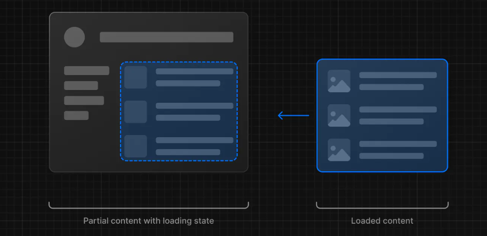
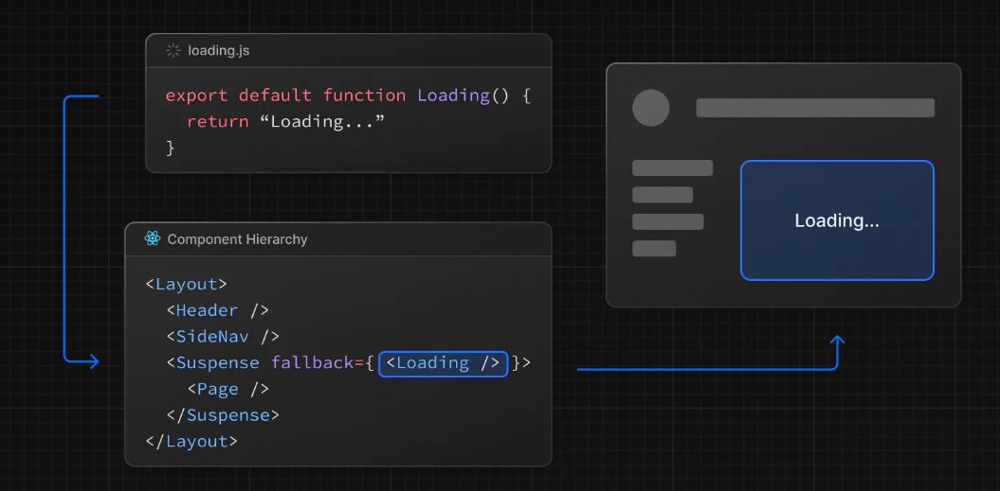
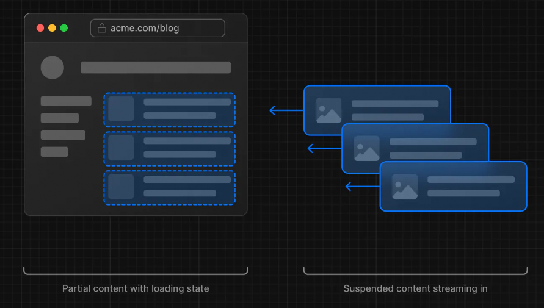

# Loading UI and Streaming


## Loading UI

Chệ độ hiển thị UI chờ trước khi dữ liệu được fetch xong



### Cách thực hiện


Tạo route bạn tạo một file loading.tsx

```html
app
├── products
│   ├── [slug]
│       ├── loading.tsx 
│       ├── page.tsx 
├── layout.jsx
|── page.tsx
```


```tsx
export default function Loading() {
  // You can add any UI inside Loading, including a Skeleton.
  return <LoadingSkeleton />
}
```

**NextJs sẽ tự động bao page.tsx với một <Suspense> như dưới đây**




## Streaming with Suspense

Streaming cho phép bạn chia nhỏ các UI thành các phần và load từng phần một



Mỗi UI Component như vậy bạn bọc lại trong Suspense kiểu như sau

```tsx
import { Suspense } from 'react'
import { PostFeed, Weather } from './Components'
 
export default function Posts() {
  return (
    <section>
      <Suspense fallback={<p>Loading feed...</p>}>
        <PostFeed />
      </Suspense>
      <Suspense fallback={<p>Loading weather...</p>}>
        <Weather />
      </Suspense>
    </section>
  )
}
```